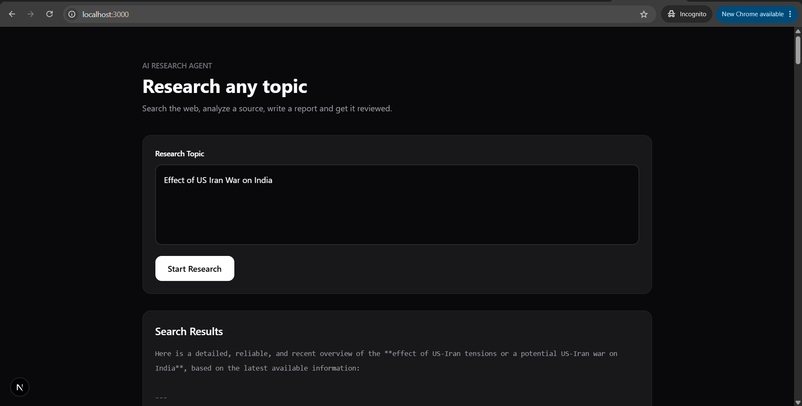

# Multi-Agent Research System

A multi-agent research system that takes a user-provided topic, searches the web for relevant information, extracts deeper content from a selected source, generates a structured research report, and evaluates the generated report using a critic agent.

The project is built with Python, LangChain, Mistral, Tavily, BeautifulSoup, FastAPI, and Next.js.



## Overview

The system follows a sequential research pipeline:

```text
User Topic
    |
    v
Search Agent
    |
    v
Reader Agent
    |
    v
Writer Chain
    |
    v
Critic Chain
    |
    v
Research Report + Critic Feedback
```

Each stage has a specific responsibility:

1. Search Agent finds recent and relevant information from the web.
2. Reader Agent identifies a relevant source and extracts deeper content from the URL.
3. Writer Chain combines the search results and extracted content to generate the research report.
4. Critic Chain reviews the generated report and provides a structured evaluation.

The pipeline can be executed directly from the terminal or exposed through a FastAPI API for integration with a Next.js frontend.

---

## Features

* Web-based research using Tavily
* LLM-powered search agent
* URL content extraction using Requests and BeautifulSoup
* Separate reader, writer, and critic stages
* Structured research report generation
* Critic-based report evaluation
* Terminal-based execution
* FastAPI backend integration
* Next.js frontend integration
* Environment variable based API key configuration
* Modular agent and tool architecture

---

## Tech Stack

### Backend

* Python
* FastAPI
* Uvicorn
* LangChain
* Mistral AI
* Tavily
* BeautifulSoup
* Requests
* Pydantic
* python-dotenv

### Frontend

* Next.js
* React
* TypeScript
* Tailwind CSS

---

## Project Structure

```text
multi-agent-system/
|
├── backend/
│   ├── agents.py
│   ├── tools.py
│   ├── pipeline.py
│   ├── main.py
│   ├── requirements.txt
│   └── .env
|
└── frontend/
    ├── app/
    │   ├── page.tsx
    │   ├── layout.tsx
    │   └── globals.css
    |
    └── components/
        ├── ResearchForm.tsx
        ├── ResearchProgress.tsx
        └── ResearchResult.tsx
```

---

# Architecture

## 1. Search Agent

The Search Agent is responsible for finding relevant information about the requested topic.

It uses the Tavily search tool and returns source information including titles, URLs, and content snippets.

The search tool is exposed to LangChain through a tool definition.

Conceptually:

```text
Topic
  |
  v
Search Agent
  |
  v
Tavily
  |
  v
Search Results
  |
  +-- Title
  +-- URL
  +-- Snippet
```

The current implementation limits the Tavily search to three results.

---

## 2. Reader Agent

The Reader Agent receives the search results and selects a relevant URL for deeper extraction.

The URL is passed to the `scrap_url` tool, which:

* Sends an HTTP request to the URL
* Parses the HTML using BeautifulSoup
* Removes unnecessary elements such as scripts, styles, navigation, and footer content
* Converts the remaining page content into text

The current scraper implementation uses Requests and BeautifulSoup.

Current flow:

```text
Search Results
      |
      v
Reader Agent
      |
      v
Relevant URL
      |
      v
scrap_url()
      |
      v
Extracted Content
```

---

## 3. Writer Chain

The Writer Chain receives:

* The original topic
* Search results
* Scraped source content

It then generates a structured research report.

The current writer prompt requests the following structure:

```text
Introduction

Key Findings

Conclusion

Sources
```

The writer is implemented using a `ChatPromptTemplate`, the Mistral model, and `StrOutputParser`.

---

## 4. Critic Chain

The Critic Chain reviews the generated research report.

It evaluates the report and returns:

```text
Score: X/10

Strengths:
- ...

Areas to Improve:
- ...

One line verdict:
...
```

The critic is implemented as a separate LangChain chain using the same LLM.

The current pipeline generates the critic feedback after the report is produced. It does not currently feed the critic feedback back into the writer for an automatic rewrite cycle.

---

# Research Pipeline

The complete pipeline is implemented in `pipeline.py`.

The main function is:

```python
run_research(topic: str) -> dict
```

The function maintains a state dictionary containing:

```text
search_results
scraped_content
report
feedback
```

The pipeline executes the following stages sequentially:

```text
1. Search
      |
2. Read
      |
3. Write
      |
4. Critic
      |
5. Return State
```

The terminal entry point accepts a topic using Python's `input()` function and passes it to `run_research()`.

---

# Model Configuration

The project currently uses Mistral through LangChain:

```python
llm = ChatMistralAI(
    model="mistral-medium-3-5",
    temperature=0
)
```

The model is configured with temperature `0` to keep the research and evaluation pipeline more deterministic.

---

# Tools

## Web Search

The `web_search` tool is responsible for retrieving web search results.

It uses:

```text
TavilyClient
```

and returns:

```text
Title
URL
Snippet
```

for each result.

## URL Scraper

The `scrap_url` tool retrieves webpage content using:

```text
Requests
    +
BeautifulSoup
```

The scraper removes:

```text
script
style
nav
footer
```

elements before extracting readable text.

---

# Installation

## Prerequisites

Make sure the following are installed:

* Python 3.10+
* Node.js 18+
* npm
* Git

You also need API keys for:

* Mistral AI
* Tavily

---

## Backend Setup

Clone the repository:

```bash
git clone <your-repository-url>
cd multi-agent-system
```

Move into the backend directory:

```bash
cd backend
```

Create a virtual environment:

### Windows

```bash
python -m venv .venv
```

Activate it:

```bash
.venv\Scripts\activate
```

### macOS / Linux

```bash
python3 -m venv .venv
source .venv/bin/activate
```

Install dependencies:

```bash
pip install -r requirements.txt
```

---

# Environment Variables

Create a `.env` file inside the `backend` directory:

```env
MISTRAL_API_KEY=your_mistral_api_key
TAVILY_API_KEY=your_tavily_api_key
```

Do not commit `.env` to GitHub.

Add the following to `.gitignore`:

```gitignore
.env
.venv/
__pycache__/
*.pyc
```

---

# Running the Agent from the Terminal

From the `backend` directory:

```bash
python pipeline.py
```

The application will ask:

```text
Enter your research Topic:
```

Example:

```text
Enter your research Topic: AI agents in software development
```

The pipeline will then execute:

```text
Step 1 - Search Agent
Step 2 - Reader Agent
Step 3 - Writer
Step 4 - Critic
```

The final state contains the generated report and critic feedback.

---

# FastAPI API

The same research pipeline can be exposed through FastAPI.

Start the backend:

```bash
uvicorn main:app --reload
```

The API will be available at:

```text
http://localhost:8000
```

Swagger documentation:

```text
http://localhost:8000/docs
```

Health check:

```http
GET /health
```

Research endpoint:

```http
POST /api/research
```

Request body:

```json
{
  "topic": "AI agents in software development"
}
```

Example response:

```json
{
  "success": true,
  "topic": "AI agents in software development",
  "search_results": "...",
  "scraped_content": "...",
  "report": "...",
  "feedback": "..."
}
```

The API layer calls the existing `run_research()` function rather than duplicating the research logic.

---

# Frontend

The Next.js frontend provides a web interface for submitting research topics and displaying the results returned by the FastAPI backend.

The frontend contains three primary UI responsibilities:

```text
Research Form
      |
      v
FastAPI API
      |
      v
Research Result
```

The UI displays:

* Research topic input
* Search results
* Scraped content
* Generated research report
* Critic feedback
* Loading state
* API errors

---

## Frontend Setup

From the project root:

```bash
cd frontend
```

Install dependencies:

```bash
npm install
```

Create:

```text
.env.local
```

Add:

```env
NEXT_PUBLIC_API_URL=http://localhost:8000
```

Start the development server:

```bash
npm run dev
```

Open:

```text
http://localhost:3000
```

---

# Request Flow

When a user submits a topic through the frontend:

```text
Next.js
   |
   | POST /api/research
   |
   v
FastAPI
   |
   | run_research(topic)
   |
   v
Search Agent
   |
   v
Reader Agent
   |
   v
Writer Chain
   |
   v
Critic Chain
   |
   v
FastAPI JSON Response
   |
   v
Next.js
   |
   v
Research Report
```

This keeps the AI logic inside the backend while the frontend remains responsible for presentation and user interaction.

---

# Configuration

The primary model configuration is located in `agents.py`.

The search and reader agents are created using LangChain's agent API:

```python
create_agent(
    model=llm,
    tools=[...]
)
```

The Search Agent receives the web search tool, while the Reader Agent receives the URL scraping tool.

The writer and critic are implemented separately as LangChain chains.

---

# Error Handling

The scraper currently catches request and general exceptions and returns an error message as text.

Example:

```text
Could Not scrap Url: ...
```

The FastAPI layer additionally catches pipeline exceptions and returns an HTTP 500 response.

For production deployment, the error handling layer should be extended with structured logging, retries, request timeouts, and more specific exception types.

---

# Current Limitations

This project is currently a research-agent prototype and has several intentional limitations.

### Single-source deep reading

The Reader Agent currently selects the most relevant URL and scrapes that source instead of performing parallel extraction across multiple sources.

### Search result limit

The current Tavily tool requests a maximum of three search results.

### Basic webpage extraction

The scraper uses HTTP requests and static HTML parsing. JavaScript-rendered pages may not be fully accessible through this approach.

### No automatic revision loop

The Critic evaluates the article, but the feedback is not currently sent back to the Writer automatically.

The current flow ends after critic evaluation.

### No persistent storage

The current implementation does not persist research sessions, reports, sources, or user information in a database.

### No authentication

Authentication and user management are not currently part of the backend implementation.

---

# Future Improvements

The architecture can be extended with:

* Multi-source research
* Parallel URL scraping
* Source credibility scoring
* Source deduplication
* Automatic fact verification
* Critic-to-writer revision loops
* Structured source metadata
* Research history
* Database persistence
* Authentication
* Background jobs
* Research session IDs
* Streaming agent progress
* SEO optimization
* Article export
* Citation generation
* Better JavaScript-rendered page extraction
* LangGraph-based state management

A possible future pipeline:

```text
User Topic
    |
    v
Research Planner
    |
    v
Multiple Search Queries
    |
    v
Source Collection
    |
    v
Source Evaluation
    |
    v
Parallel Scraping
    |
    v
Research Synthesis
    |
    v
Article Writer
    |
    v
Fact Checker
    |
    v
Critic
    |
    v
Revision
    |
    v
Final Article
```

---

# Development Notes

The project intentionally separates responsibilities across files.

```text
tools.py
    External tools

agents.py
    LLM and agent definitions

pipeline.py
    Orchestration

main.py
    HTTP/API layer

frontend/
    User interface
```

This separation allows the underlying research pipeline to be reused independently of the web interface.

For example, the pipeline can still be executed directly:

```bash
python pipeline.py
```

while the same function can be called through FastAPI.

---

# Security Considerations

API keys should always be stored in environment variables.

Never expose:

```text
MISTRAL_API_KEY
TAVILY_API_KEY
```

to the Next.js client.

The browser should communicate only with the FastAPI API.

For production deployment, additional controls should be added:

* Input validation
* Rate limiting
* Request size limits
* SSRF protection for arbitrary URLs
* URL allow/deny policies
* Authentication
* API key protection
* Structured logging
* Retry limits
* Request timeouts

---

# License

Add the license that matches your intended usage.

For example:

```text
MIT License
```

if you want the project to be open-source under the MIT license.

---

# Author

Mohammad Ayaz

Built as an experimental multi-agent research system using LangChain, Mistral, Tavily, FastAPI, and Next.js.
